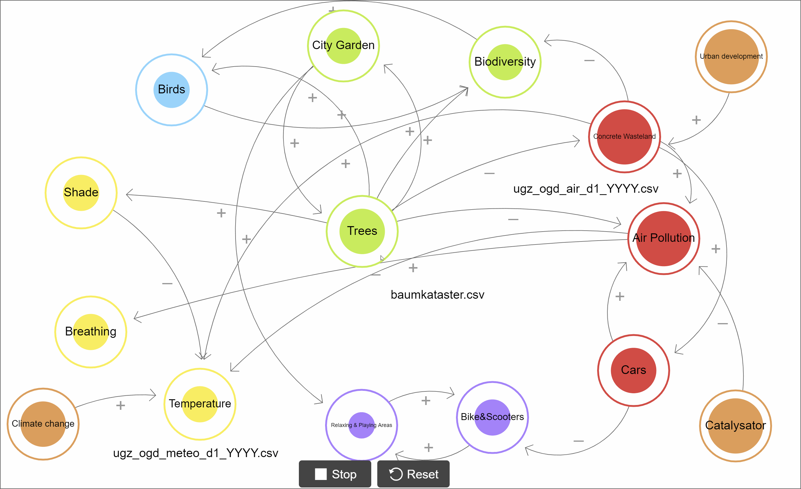
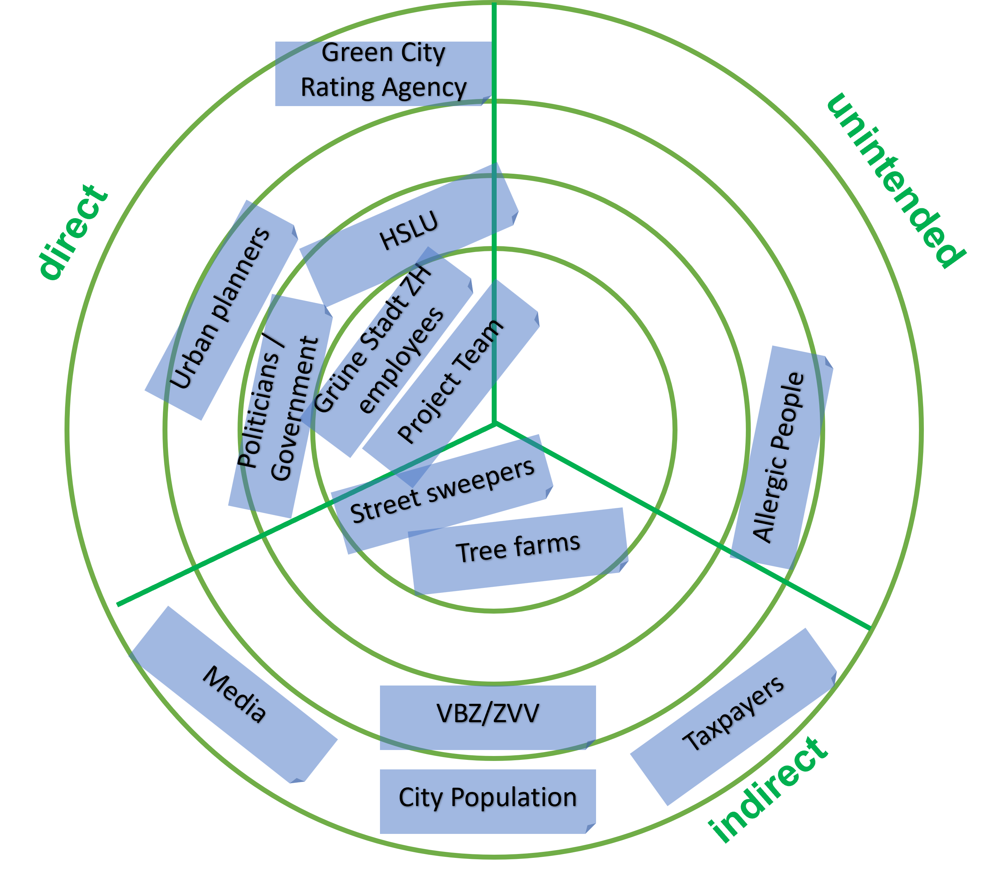
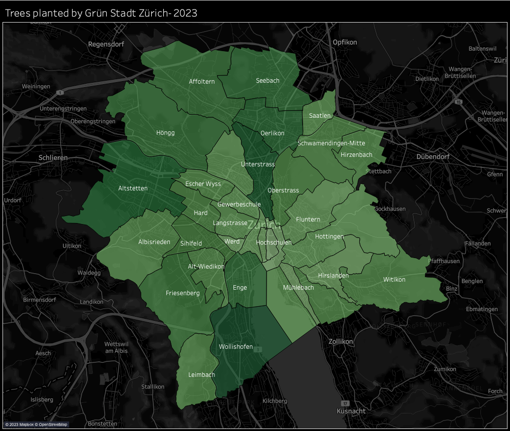

```{r setup, include=FALSE}
knitr::opts_chunk$set(echo = TRUE)
```

# TREES  -  TREES  -  TREES

## Introduction
Vegetative cooling, or using plants to shield urban environments from the sun’s radiation, has been somewhat of a hot topic in recent years. While there has been ample research on the hyper-local effect to reduce or even eliminate heat islands, our research focuses on the question of whether or not we can identify the effect of the efforts of urban vegetative cooling in the city of Zurich on a larger scale. Furthermore, we investigate if there is any correlation with different factors in regards to air quality.


## Goal of the project
We would like to prove that the planting of trees and the development of green spaces in an urban environment have positive correlations with the development of air quality indicators and a negative impact on temperatures in the city of Zurich. This project will try to pinpoint the effect trees have on these indicators. The results will be presented in a way to inform politicians, urban developers as well as the public about the impact that a more green city could have on our everyday lives. 
While there are a number of potential factors, both local and national/global, can have a significant impact on the climate and for this research we are choosing to focus on data from Zürich in regards to air quality, temperature information and the tree inventory. Further factors are described using sources, but are not included in the data analysis.
To clarify our project goal and narrow it down we drew the following picture: 

  

It shows two potential futures for Zürich. One with more green spaces and one with more urban wasteland. The idea of the project is to find out how much the trees and green spaces actually impact the city of Zürich in regard to temperature and air pollution. 

Scope & limitations
Our data sets are limited to the trees planted by garden and forestation services of the municipality of Zurich, and only include roadside and park trees. The effect of local de- or reforestation thus cannot be accounted for. Furthermore, temperature data was taken from roadside stations that could themselves potentially be located within heat islands.
Furthermore, as our analysis moves beyond a micro-scale, there are many more factors that we cannot control for, both on the local and macro-environmental level.
A factor that we did not control for, which could have large implications on the macro scale of temperature, is the potential disappearance of undeveloped land and urban expansion. Additionally, an analysis of building materials used was also out of the scope of this analysis.
To visualize the scope and limitations of our project, we have created a systems view that can be seen below.



### Stakeholders
To ensure we include all potential stakeholders in our project at the appropriate level we create the following stakeholder map: 



We sorted them into three possible categories: "direct", "indirect", "unintended". Our main target is to work together with Grüne Stadt Zürich an convince the politicians, the goverment and urban planners on the benefits of a greener city.


## Big Picture: Embedding in the Sustainable Development Goals (SDG)
The SDGs lay out the goals that the global community (United Nations General Assembly in 2015) has agreed on. Total there are 17 goals and they range from 1. No poverty to 17. Partnerships for the goals and include social, economic and environmental targets. For the research we have identified the relevant goals and put them into the three different categories: Risk, Opportunity and Intended. 

As can be seen the intended target for our research is to help achieve the goal number 3. Good health and well being. This can be achieved if we can prove a correlation between the amount of trees in a region and an improvement in air quality, which could then lead to increase of planting of new trees in Zürich as well as a reduction of concrete wastelands in favor of green spaces. There are a number opportunities as well in regards to climate action, economic growth and affordable and clean energy. The are only limited risks that this project has. However it is imaginable that the improvement in air quality in certain areas could lead to a increase in inequalities between the rich and poor. It is also important to always be responsible and think of possible unintended consequences while planning for new green zones and planting new trees.


## Data sources
For the research there are three different data sets needed: Air quality information, temperature data, and a tree cadastre. All of these three data sets are publicly available. Following is a quick overview over the different data sets:

### Air quality
Format: csv  
Number of rows: 283'763  
Number of variables: 8 (most important: date, location, type of measurement, value)   
Source: https://data.stadt-zuerich.ch/dataset/ugz_luftschadstoffmessung_stundenwerte  

### Meteo
Format: csv  
Number of rows: 4'747  
Number of variables: 17 (most important: date, temperature, location)   
Source: https://opendata.swiss/de/dataset/taglich-aktualisierte-meteodaten-seit-1992   

### Tree cadastre
Format: csv  
Number of rows: 36'239  
Number of variables: 17 (most important: year of  planting, diameter of crown, 
district)   
Source: https://data.stadt-zuerich.ch/dataset/geo_baumkataster   


## Importing all packages and libraries
The following libraries were used to analyse the data:

```{r lib, echo=FALSE, include=FALSE, message=FALSE, warning=FALSE}
library(tidyverse)
library(tseries)
library(astsa)
library(imputeTS)
library(forecast)
library(magrittr)
library(dplyr)
library(lubridate)
library(tidyr)  
library(ggplot2)
library(reshape2) 

```

## Data preparation
In this step we collected the three data sets and prepared them so that they are for use in the analysis. To achieve this, certain changes to the data were necessary to facilitate an informative analysis. 

First we loaded the tree cadastre data and wrangled the data to get additional information such as the amount of trees per year and the number of trees by district.
```{r trees, echo=TRUE}
d.trees <- read.csv('../datasets/gsz.baumkataster_baumstandorte.csv', encoding = "UTF-8")
names(d.trees)[1] <- "objid" 
#head(trees)
#str(trees)


#Wrangling and mutating tree data

# trees by year
tree_ts <- d.trees %>%
  dplyr::select(pflanzjahr) %>%
  filter(pflanzjahr > 1980) %>%
  group_by(pflanzjahr) %>%
  summarise(count = n())

# Trees by district
tree_quartier <- d.trees %>%
  dplyr::select(pflanzjahr, objid, quartier) %>%
  filter(pflanzjahr > 1980) %>%
  group_by(pflanzjahr, quartier) %>%
  summarise(count = n())


# sum of trees
tree_ts_sum <- tree_ts %>%
 mutate(sum_trees = cumsum(count))


# Trees by district, year
tree_quartier_year_full <- d.trees %>%
  dplyr::select(pflanzjahr, quartier, kronendurchmesser) %>%
  filter(pflanzjahr > 1980) %>%
  group_by(pflanzjahr, quartier) %>%
  summarise(count = n(), sum_crown = sum(kronendurchmesser))

# trees by year
tree_year <- d.trees %>%
  dplyr::select(pflanzjahr, kronendurchmesser) %>%
  filter(pflanzjahr > 1980) %>%
  group_by(pflanzjahr) %>%
  summarise(tree_count = n(), crown_sum = sum(kronendurchmesser))

tree_year_sum <- tree_year %>%
  mutate(cum_trees = cumsum(tree_count)) %>%
  mutate(cum_crown = cumsum(crown_sum))


```

Next we load all the temperature information from the meteo data set. While this data set includes other information such as rain duration we will only use the temperature, as it seems unlikely that the amount of trees significantly impact the rain fall in an area. 

```{r temp, echo=TRUE}
filenames.meteo <- list.files(path = "../datasets/meteo/", pattern = "*.csv", full.names = TRUE)
data_list.meteo <- lapply(filenames.meteo, read.csv)
# Combine the data frames in the list into a single data frame
meteo <- do.call(rbind, data_list.meteo)

names(meteo)[1] <- "Date"
meteo$Date <- format(as.Date(meteo$Date), format = "%Y-%m-%d")

# Datensatz mit Temperatur und Globalstrahlung pro Messstation
meteo.extr <- meteo %>%
  filter(Parameter == "T" | Parameter == "StrGlo" | Parameter =="T_max_h1")
meteo.extr$Jahr <- year(meteo.extr$Date)

# weiter mit "normalem" Meteodatensatz
meteo <- meteo[meteo$Standort=="Zch_Stampfenbachstrasse",]
meteo <- meteo %>% 
  select(c("Date","Parameter","Wert")) %>%
  pivot_wider(id_cols = "Date",names_from = "Parameter",values_from = "Wert") %>%
  select(c("Date","T","RainDur","p"))

meteo$Date <- ymd(meteo$Date)

head(meteo)
```

Lastly the air quality data is loaded. While there are multiple location were air quality was measured not every station measured each variable. They also were not all built at the same time. 

```{r air, echo=TRUE}

filenames.air <- list.files(path = "../datasets/air/", pattern = "*.csv", full.names = TRUE)
data_list.air <- lapply(filenames.air, read.csv)
# Combine the data frames in the list into a single data frame
air <- do.call(rbind, data_list.air)
names(air)[1] <- "Date"
air$Date <- as.Date(format(air$Date), "%Y-%m-%d")
# add column Jahr
air$Jahr <- as.numeric(format(air$Date,'%Y'))
head(air)

air.wide <- air %>% 
  filter(Standort == "Zch_Stampfenbachstrasse") %>%
  select(c("Date", "Parameter", "Wert")) %>%
  pivot_wider(id_cols = "Date", names_from = "Parameter", values_from = "Wert")

air.short <- air[air$Standort=="Zch_Stampfenbachstrasse",]

air.short <- air.short %>%
  select(c("Date", "Parameter", "Wert")) %>%
  pivot_wider(id_cols = "Date",names_from = "Parameter",values_from = "Wert")

keep <- c("Date", "CO", "NOx")
air.short <- air.short[keep]
keep <- c("Date", "CO")
air.co <- air.short[keep]
keep <- c("Date", "NOx")
air.NOx <- air.short[keep]
#air.NOx <- air["NOx"] <- log(air["NOx"])

```


## Insights into our datasets
To gain insights from the available information we have created a number of graphics. These already show preliminary results of our project.

```{r plot_air, echo=TRUE}

#melt data frame into long format
air.plot <- melt(air.co,  id.vars = "Date")
#create line plot for each column in data frame
ggplot(air.plot, aes(Date, value), group = 5) +
  geom_line(aes(colour = variable))

```

```{r air.means, echo=TRUE}

air.means = air %>% 
  filter(!is.na(Wert)) %>% 
  group_by(Parameter, Jahr) %>%
  summarize(Mean = round(mean(Wert),2),
            .groups = "drop")

```

The following graphs show the development over time for some specific air pollutants as of 1983.

```{r air_mean_line_graphs, echo=FALSE, fig.show="hold", out.width="33%", fig.cap = "Fig. nnn: Carbon monoxide and particulate matter"}
plot(subset(air.means, Parameter == "CO", 
            c(Jahr, Mean)), type = "l",
     main = "Mean of CO per Year [mg/m3]")  

plot(subset(air.means, Parameter == "PM10",
            c(Jahr, Mean)), type = "l",
     main = "Mean of PM10 per Year [mg/m3]") 

plot(subset(air.means, Parameter == "PM2.5",
            c(Jahr, Mean)), type = "l",
     main = "Mean of PM2.5 per Year [mg/m3]") 
```

Figure nnn above on the left hand shows the mean amount of carbon monoxide per year as of 1983. The average could be reduced to a large extent until 1990, but we couldn't find a explanation in the internet to which we could refer, as most time series only start as of 1990. We assume that this is - besides other potential influencing factors - a direct impact of the implementation of catalysts in the cars, which should reduce carbon monoxide, hydrocarbon and nitrogen oxyds. The two graphs on the right side show two different sizes of particulate matter, for which we only have data as of 2017 for the very small particulate matter PM2.5. We can observe in the two graphs an improvement over the years as well.  


```{r air_mean_no_line_graphs, echo=TRUE, fig.show="hold", out.width="33%"}
plot(subset(air.means, Parameter == "NO", 
            c(Jahr, Mean)), type = "l",
     main = "Mean of NO per Year [µg/m3]")

plot(subset(air.means, Parameter == "NO2", 
            c(Jahr, Mean)), type = "l",
     main = "Mean of NO2 per Year [µg/m3]")

plot(subset(air.means, Parameter == "NOx", 
            c(Jahr, Mean)), type = "l",
     main = "Mean of NOx per Year [ppb]")


#nrow(air[air.means$Parameter == "NO" & air.means$Jahr == "2008"])
#nrow(air[air.means$Parameter == "NO" & air.means$Jahr == "2009"])
#nrow(subset(air.means,sCode == "CA"))

```


Nitric Oxide
Nitrogen dioxide
Nitrogen oxides


```{r next_air_mean_o_line_graphs, echo=FALSE, fig.show="hold", out.width="33%"}
plot(subset(air.means, Parameter == "O3", 
            c(Jahr, Mean)), type = "l",
     main = "Mean of O3 per Year [µg/m3]") 

plot(subset(air.means, Parameter == "O3_max_h1",
            c(Jahr, Mean)), type = "l",
     main = "Mean of O3_max_h1 per Year [µg/m3]") 

plot(subset(air.means, Parameter == "O3_nb_h1>120",
            c(Jahr, Mean)), type = "l",
     main = "Mean of O3_nb_h1>120 per Year [1]") 

```


```{r next_air_mean_rest_line_graphs, echo=FALSE, fig.show="hold", out.width="50%", fig.align='center'}
plot(subset(air.means, Parameter == "PN",
            c(Jahr, Mean)), type = "l",
     main = "Mean of PN per Year [1/cm3]") 

plot(subset(air.means, Parameter == "SO2",
            c(Jahr, Mean)), type = "l",
     main = "Mean of SO2 per Year [µg/m3]")

```

One can see that the both the "NOx" and the "CO" graph show that the air quality has improved significantly since 1980. It is unlikely to say the least that trees are the only factor in this improvement. More likely other factors such as new laws and regulations in regards to catalysts of cars are more likely the major factor.


```{r air.boxplots, echo=TRUE}

# Boxplots for CO all over Zürich
boxplot(Wert ~ Jahr, data = air, subset = Parameter %in% names(table("CO")),
        main= "CO in Zürich (Stampfenbachstrasse) per Year [mg/m3]",
        xlab = "Year", ylab = "mg/m3")
boxplot(Wert ~ Jahr, data = air, subset = Parameter %in% names(table("NOx")),
        main= "NOx in Zürich per Year [ppb]",
        xlab = "Year", ylab = "ppb")

# Boxplots for NOx per monitoring station
#air.he <- air %>% filter(Standort == "Zch_Heubeeribüel")
air.ro <- air %>% filter(Standort == "Zch_Rosengartenstrasse")
air.sc <- air %>% filter(Standort == "Zch_Schimmelstrasse")
air.st <- air %>% filter(Standort == "Zch_Stampfenbachstrasse")

# boxplot(Wert ~ Jahr, data = air.he, subset = Parameter %in% names(table("NOx")),
#         main= "NOx at Heubeeribuel per Year [ppb]",
#         xlab = "Year", ylab = "ppb")
boxplot(Wert ~ Jahr, data = air.ro, subset = Parameter %in% names(table("NOx")),
        main= "NOx at Rosengartenstrasse per Year [ppb]",
        xlab = "Year", ylab = "ppb")
boxplot(Wert ~ Jahr, data = air.sc, subset = Parameter %in% names(table("NOx")),
        main= "NOx at Schimmelstrasse per Year [ppb]",
        xlab = "Year", ylab = "ppb")
boxplot(Wert ~ Jahr, data = air.st, subset = Parameter %in% names(table("NOx")),
        main= "NOx at Stampfenbachstrasse per Year [ppb]",
        xlab = "Year", ylab = "ppb")

```

```{r tree_pflanzjahr, echo=TRUE}

# bar chart pflanzjahr alle
ggplot(d.trees, aes(x = pflanzjahr)) +
  geom_bar() +
  labs(title="Trees per year planted")
# bar chart nur neuere pflanzjahre
ggplot(d.trees[trees$pflanzjahr > 1949, ], aes(x = pflanzjahr)) +
  geom_bar() +
  labs(title="Trees planted as of 1950")

# bar chart kronendurchmesser
ggplot(d.trees, aes(x = kronendurchmesser)) +
  geom_bar() +
  labs(title="Number of trees per crown diameter")

```
As one can see there is a trend to planting more trees in Zürich. However, there are also quite a few outliers visible in the graph. These outliers can usually be explained quite easily with replanting efforts. For example in 2000 a larger number of trees than normal were planted as replacements for all the trees that were blown down or had to be cut down because of cyclone Lothar in December of 1999.

## Analysis
Having gained an overview of the data, we would now like to analyse the data in more detail using a few different methodologies.

### Timeseries Analysis
In this section we are trying to see if there is a correlation over time between the amount of trees and the air quality or temperature. For this we use timeseries analysis, meaning we need to convert our data into timeseries objects. After transforming them we can then look at the decomposition of the objects. Thus we are able to see trends, seasonality and residuals. However the seasonality is only visible for air pollution and temperature, as the tree information is only available on a yearly basis. 
```{r time_meteo, echo=TRUE}

meteo %<>% complete(Date=seq.Date(min(Date), max(Date), by='day'))

# Use the time series class of the library stats
freq_daily <- 365.2422
temp <-
  ts(meteo$T, start=c(year(min(meteo$Date)),yday(min(meteo$Date))),
     frequency=freq_daily) %>%
  na_replace(fill=0)

# Stationarity test and decomposition
# adf.test(temp,k=0)
temp_comp=decompose(temp)
plot(temp_comp)
title(sub = "Temperature")

# Manual decomposition
meteo %<>% mutate(year=year(meteo$Date)+yday(meteo$Date)/freq_daily)
temp_trend <- lm(meteo$T~meteo$year)
plot(temp, main="Temperature trend per year")
abline(temp_trend)

# Prepare yearly data
meteo_yr <- meteo %>%
  mutate(temp_raw=replace_na(T,0)) %>%
  group_by(Year=year(Date)) %>%
  filter(Year>=1980 & Year<=2021) %>%
  summarize(temp=mean(temp_raw)) %>%
  ungroup()

temp_yr <- ts(temp, start=min(meteo_yr$Year))
tb_temp_ts <- tbats(temp_yr)

# Differ
## twice-difference the CO2 data
temp_d2 <- diff(temp, differences = 1)
## plot the differenced data
# plot(temp_d2, ylab = "Temperature without trend")

## difference the differenced CO2 data
temp_d2d12 <- diff(temp_d2, lag = 12)
## plot the newly differenced data
plot(temp_d2d12, ylab = "Temperature without trend and seasonality")

```
Generally we can see that the temperature is slightly rising over time. There is a slight upwards trend noticeable and it is also important to remember how much danger a temperature increase of just one percent can be for the biodiversity. 

```{r time_air, echo=TRUE}

air.short %<>% complete(Date=seq.Date(min(Date), max(Date), by='day'))

# Use the time series class of the library stats
freq_daily <- 365.2422
co <-
  ts(air.short$CO, start=c(year(min(air.short$Date)),yday(min(air.short$Date))),
     frequency=freq_daily) %>%
  na_replace(fill=0)
NOx <-
  ts(air.short$NOx, start=c(year(min(air.short$Date)), yday(min(air.short$Date))),
     frequency=freq_daily) %>%
  na_replace(fill=0)

# Stationarity test and decomposition
# adf.test(co,k=0)
# adf.test(NOx,k=0)
co_comp=decompose(co)
NOx_comp=decompose(NOx)
# plot(co_comp)
# title(sub = "CO")
# plot(NOx_comp)
# title(sub = "NOx")


# Manual decomposition
air.short %<>% mutate(year=year(air.short$Date)+yday(air.short$Date)/freq_daily)
co_trend <- lm(air.short$CO~air.short$year)
NOx_trend <- lm(air.short$NOx~air.short$year)
# plot(co, main="CO trend per year")
# abline(co_trend)
# plot(NOx, main="NOx trend per year")
# abline(NOx_trend)

air_yr <- air.short %>%
  mutate(co_raw=replace_na(CO,0), NOx_raw=replace_na(NOx,0)) %>%
  group_by(Year=year(Date)) %>%
  filter(Year>=1980 & Year<=2021) %>%
  summarize(co=sum(co_raw), NOx=mean(NOx_raw)) %>%
  ungroup()

# Time series
co_yr <- ts(air_yr$co, start=min(air_yr$Year), frequency=1)
NOx_yr <- ts(air_yr$NOx, start=min(air_yr$Year), frequency=1)

# plot(co_yr)
# plot(NOx_yr)

# Manual decomposition
co_yr_trend <- lm(air_yr$co~air_yr$Year)
plot(co_yr, xlab='Year', ylab='Average co pollution')
abline(co_yr_trend)
title(main = "CO development over the years and trend line")
NOx_yr_trend <- lm(air_yr$NOx~air_yr$Year)
plot(NOx_yr, xlab='Year', ylab='Average NOx pollution')
abline(NOx_yr_trend)
title(main = "NOx development over the years and trend line")


# plot(co_yr)
# pacf(co_yr)
# plot(tbats(co_yr))
# title(sub = "CO ")
tree_ts <-  ts(tree_ts_sum$sum_trees, start=min(tree_ts_sum$pflanzjahr), frequency=1)
tb_tree_ts <- tbats(tree_ts)
tb_co_ts <- tbats(co_yr)
tb_nox_ts <- tbats(NOx_yr)

plot(residuals(tb_co_ts))
title(main = "Residuals of CO")
plot(residuals(tb_nox_ts))
title(main = "Residuals of NOx")

# adf.test(co_yr)

# "Forecast"
# plot(forecast(co_yr))
```
The timeseries analysis of Carbon monoxide (co) and Nitrogen oxide (NOx) show that the they are closely correlated. It is further clear that they have both decreased drastically since the 1980 in Zürich. It is unlikely that the whole change can be attributed to the growing number of trees and green spaces in Zürich. It is more likely that a variety of factors including advancement in technologies and changes in laws and regulations contributed as well to the improvement in air quality.

```{r correlation, echo=TRUE}

# Make the time series comparable
temp_comp_random <- data.frame(Date=time(temp_comp$random), Random=temp_comp$random)
co_comp_random <- data.frame(Date=time(co_comp$random), Random=co_comp$random)
NOx_comp_random <- data.frame(Date=time(NOx_comp$random), Random=NOx_comp$random)
#trees_comp_random <- data.frame(Date=time(trees_comp$random), Random=trees_comp$random)


window <- list(start=1980,end=2021)

temp_comp_random %<>% filter(Date>=window$start&Date<window$end)
co_comp_random %<>% filter(Date>=window$start&Date<window$end)
NOx_comp_random %<>% filter(Date>=window$start&Date<window$end)
#trees_comp_random %<>% filter(Date>=window$start&Date<window$end)

temp_comp_random_ts <- ts(temp_comp_random$Random, start=c(window$start,1), frequency=freq_daily)
co_comp_random_ts <- ts(co_comp_random$Random, start=c(window$start,1), frequency=freq_daily)
NOx_comp_random_ts <- ts(NOx_comp_random$Random, start=c(window$start,1), frequency=freq_daily)
#trees_comp_random_ts <- ts(trees_comp_random$Random, start=c(window$start,1), frequency=freq_daily)


# Cross correlation function
# ccf(temp_comp_random_ts,co_comp_random_ts)

# ccf(temp_comp_random_ts, co_comp_random_ts, 
#     lag.max = 300,
#     main = "Temp - CO Cross-Correlation Plot",
#     ylab = "CCF", 
#     na.action = na.pass)

ccf(residuals(tb_tree_ts), residuals(tb_nox_ts), 
    lag.max = 300,
    main = "Trees - NOx Cross-Correlation Plot",
    ylab = "CCF")
ccf(residuals(tb_tree_ts), residuals(tb_co_ts), 
    lag.max = 300,
    main = "Trees - CO Cross-Correlation Plot",
    ylab = "CCF")
ccf(residuals(tb_tree_ts), residuals(tb_temp_ts), 
    lag.max = 300,
    main = "Trees - Temperature Cross-Correlation Plot",
    ylab = "CCF")

```

Now one can see the correlations between the sum of trees and air quality (CO and NOx) as well as the correlation between the sum of trees and temperature. The graphs shows no strong correlations, although a slightly significant correlation with a lag is visible for amount of trees on air quality. Meaning that after a some time a larger amount of trees could have an influence in reducing Carbon monoxide and Nitrogen oxide in the air. 

## Temperature trends


```{r temperature_trends, echo=TRUE, fig.cap = "Fig. 1: temperature trends"}

# Stampfenbach max of mean of daily temperature with trendline
meteo.sta <- meteo.extr %>%
  filter(Standort == "Zch_Stampfenbachstrasse") %>%
  filter(Parameter == "T") %>%
  group_by(Jahr, Parameter) %>%
  summarize(Max = max(Wert, na.rm = TRUE), .groups = "drop")

ggplot(meteo.sta, aes(x = Jahr, y = Max)) +
  geom_line() +
  ggtitle("Development of maximum of mean temperature at Stampfenbachstrasse") +
  geom_smooth(method = "lm", se = FALSE)

# Stampfenbach min of mean of daily temperature with trendline
meteo.sta.min <- meteo.extr %>%
  filter(Standort == "Zch_Stampfenbachstrasse") %>%
  filter(Parameter == "T") %>%
  group_by(Jahr, Parameter) %>%
  summarize(Min = min(Wert, na.rm = TRUE), .groups = "drop")

ggplot(meteo.sta.min, aes(x = Jahr, y = Min)) +
  geom_line() +
  ggtitle("Development of minimum of mean temperature at Stampfenbachstrasse") +
  geom_smooth(method = "lm", se = FALSE)

```

The left graph in Fig. nn shows the yearly development of the max of the daily means .
 


```{r temperature_trends_max, echo=TRUE, fig.cap = "Fig. 1: Text"}
###
# Stampfenbach max of max temperature with trendline
meteo.sta.max <- meteo.extr %>%
  filter(Standort == "Zch_Stampfenbachstrasse") %>%
  filter(Parameter == "T_max_h1") %>%
  group_by(Jahr, Parameter) %>%
  summarize(Max = max(Wert, na.rm = TRUE), .groups = "drop")

ggplot(meteo.sta.max, aes(x = Jahr, y = Max)) +
  geom_line() +
  ggtitle("Development of maximum daily temperature at Stampfenbachstrasse") +
  geom_smooth(method = "lm", se = FALSE)

```


```{r temperature_lm, echo=TRUE}
summary(lm(meteo.sta$Max ~ meteo.sta$Jahr))
summary(lm(meteo.sta.min$Min ~ meteo.sta.min$Jahr))
summary(lm(meteo.sta.max$Max ~ meteo.sta.max$Jahr))
```

```{r global_radiation, echo=TRUE}

# Stampfenbach mean of Globalstrahlung with trendline
meteo.sta.glo <- meteo.extr %>%
filter(Standort == "Zch_Stampfenbachstrasse") %>%
  filter(Parameter == "StrGlo") %>%
  group_by(Jahr, Parameter) %>%
  summarize(Max = max(Wert, na.rm = TRUE), .groups = "drop")

ggplot(meteo.sta.glo, aes(x = Jahr, y = Max)) +
  geom_line() +
  ggtitle("Development of mean of global radiation at Stampfenbachstrasse") +
  geom_smooth(method = "lm", se = FALSE)
summary(lm(meteo.sta.glo$Max ~ meteo.sta.glo$Jahr))
```

## Tableau Dashboards

To aid us in our geospatial analysis and to potentially communicate some of our findings to a broader public, we have created a Tableau dashboard. 
Below you can find a screenshot of one of the visualizations in our dashboard. To explore the full interactive dashboard, please follow the following link.

  
For the dashboard, some additional data wrangling was done. Furthermore the dataset had to be expanded and missing values needed to be added to create a smoother dashboard experience.

```{r Tableau data wrangling, echo=F}
###
library(tidyverse)      # select
library(ggplot2)    # ggplot
library(reshape2) 


#-----------------TREES----------------------------------

# trees by year
tree_ts <- d.trees %>%
  dplyr::select(pflanzjahr) %>%
  filter(pflanzjahr > 1980) %>%
  group_by(pflanzjahr) %>%
  summarise(count = n())

# Trees by district
tree_quartier <- d.trees %>%
  dplyr::select(pflanzjahr, objid, quartier) %>%
  filter(pflanzjahr > 1980) %>%
  group_by(pflanzjahr, quartier) %>%
  summarise(count = n())


# sum of trees
tree_ts_sum <- tree_ts %>%
  mutate(sum_trees = cumsum(count))


# Trees by district, year
tree_quartier_year_full <- d.trees %>%
  dplyr::select(pflanzjahr, quartier, kronendurchmesser) %>%
  filter(pflanzjahr > 1980) %>%
  group_by(pflanzjahr, quartier) %>%
  summarise(count = n(), sum_crown = sum(kronendurchmesser))

# trees by year
tree_year <- d.trees %>%
  dplyr::select(pflanzjahr, kronendurchmesser) %>%
  filter(pflanzjahr > 1980) %>%
  group_by(pflanzjahr) %>%
  summarise(tree_count = n(), crown_sum = sum(kronendurchmesser))

tree_year_sum <- tree_year %>%
  mutate(cum_trees = cumsum(tree_count)) %>%
  mutate(cum_crown = cumsum(crown_sum))


plot(tree_ts)

# TO DO
# Stitch Trees + Air + Temp
# Lora Sensor Data
# Tableau

tree_year_sum %>%
  ggplot(mapping = aes(x = pflanzjahr, y = cum_crown)) + geom_line()


tree_year_quartier <- d.trees %>%
  dplyr::select(pflanzjahr, quartier, kronendurchmesser) %>%
  filter(pflanzjahr > 1980) %>%
  group_by(pflanzjahr, quartier) %>%
  summarise(tree_count = n(), crown_sum = sum(kronendurchmesser), total_sum = cumsum(tree_count))

tree_year_quartier_sum <- tree_year_quartier %>%
  mutate(cum_trees = cumsum(tree_count)) %>%
  mutate(cum_crown = cumsum(crown_sum))


year_list <- do.call(seq, as.list(range(c(1983, 2023))))

tree_year_quartier$pflanzjahr

tree_year_quartier2 <- tree_year_quartier %>%
  ungroup(pflanzjahr) %>%
  dplyr::select(quartier) %>%
  expand(quartier, year_list) %>%
  rename(pflanzjahr = year_list) %>%
  full_join(tree_year_quartier, by = c('pflanzjahr', 'quartier')) %>%
  arrange(quartier, pflanzjahr) %>%
  filter(pflanzjahr > 1982) %>%
  mutate(tree_count = replace_na(tree_year_quartier2$tree_count, 0))

tree_year_quartier2$tree_sum <- 0


for (x in 2:length(tree_year_quartier2$quartier)) {
  if (tree_year_quartier2$quartier[x] == tree_year_quartier2$quartier[x-1]) {
    tree_year_quartier2$tree_sum[x] <- tree_year_quartier2$tree_count[x] + tree_year_quartier2$tree_sum[x-1]
  } else {
    tree_year_quartier2$tree_sum[x] <- tree_year_quartier2$tree_count[x]
  }
}

write_csv(tree_year_quartier2, 'tree_year_quartier_for_tableau.csv')

#-----------------AIR QUALITY----------------------------------

air_co <- air %>%
  dplyr::select(Datum, CO)

plot(air_co)


#summarise CO2 by year
yearly_air <- air %>%
  add_column(year = lubridate::year(air$Datum))

yearly_aq <- yearly_air %>%
  #dplyr::select(year, CO) %>%
  group_by(year) %>%
  summarise(mean_co = mean(CO, na.rm = T), mean_no2 = mean(NO2, na.rm = T), mean_no = mean(NO, na.rm = T), mean_nox = mean(NOx, na.rm = T), mean_so2 = mean(SO2, na.rm = T))


merged_temp <- read_csv("/Users/fluethard/hslu/sustainability/git/sustainability/datasets/merged_temp.csv")

names(merged_temp)[1] <- "date"
names(merged_temp)[2] <- "station"
names(merged_temp)[3] <- "measurement"
names(merged_temp)[4] <- "date_unit"
names(merged_temp)[5] <- "unit"
names(merged_temp)[6] <- "temperature"


year_temp_stampfenbach <- merged_temp %>%
  add_column(year = lubridate::year(merged_temp$date)) %>%
  filter(station == "Zch_Stampfenbachstrasse", measurement == "T") %>%
  dplyr::select(year, temperature) %>%
  group_by(year) %>%
  summarise(mean_temp = mean(temperature, na.rm = T))


year_temp_by_station <- merged_temp %>%
  add_column(year = lubridate::year(merged_temp$date)) %>%
  filter(measurement == "T") %>%
  dplyr::select(year, station, temperature) %>%
  group_by(year, station) %>%
  summarise(mean_temp = mean(temperature, na.rm = T))


temp_station <- merged_temp %>%
  add_column(year = lubridate::year(merged_temp$date)) %>%
  filter(measurement == "T_max_h1") %>%
  filter(year == '2022') %>%
  dplyr::select(year, station, temperature)

write_csv(temp_station, 'temp_station_for_tableau.csv')


temp_by_station_2022 <- merged_temp %>%
  add_column(year = lubridate::year(merged_temp$date)) %>%
  add_column(quartier = case_when(merged_temp$station == 'Zch_Stampfenbachstrasse' ~ 'Rathaus', merged_temp$station == 'Zch_Rosengartenstrasse' ~ 'Wipkingen', merged_temp$station == 'Zch_Schimmelstrasse' ~ 'Sihlfeld')) %>%
  filter(measurement == "T_max_h1") %>%
  filter(year == '2022') %>%
  dplyr::select(date, station, quartier, temperature)

  write_csv(temp_by_station_2022, 'temp_station_for_tableau_2022.csv')


  
  
  


  # New station data from Salomon Idaweb
  
temp_affoltern <- read.csv('/Users/fluethard/hslu/sustainability/git/sustainability/datasets/temp_affoltern.csv', sep = ';', fill = T)
  
temp_fluntern <- read.csv('/Users/fluethard/hslu/sustainability/git/sustainability/datasets/temp_fluntern.csv', sep = ';')

read.csv

ref_temp_fluntern <- temp_fluntern %>%
  dplyr::select(stn, time, ths200dx, ths200d0)

ref_temp_fluntern <- ref_temp_fluntern %>%
  rename(c(temp_mean = ths200d0, temp_max =ths200dx)) %>%
  mutate(time = lubridate::ymd(time))
  

ref_temp_fluntern_year <- ref_temp_fluntern %>%
  add_column(year = lubridate::year(ref_temp_fluntern$time)) %>%
  dplyr::select(year, stn, temp_mean) %>%
  group_by(year, stn) %>%
  summarise(mean_temp = mean(temp_mean, na.rm = T)) %>%
  filter(year > 1991) %>%
  filter(year < 2023) %>%
  rename(station = stn)

year_temp_by_station_all <- rbind(year_temp_by_station, ref_temp_fluntern_year)

year_temp_by_station_all <- year_temp_by_station_all %>%
  add_column(quartier = case_when(year_temp_by_station_all$station == 'Zch_Stampfenbachstrasse' ~ 'Rathaus', year_temp_by_station_all$station == 'Zch_Rosengartenstrasse' ~ 'Wipkingen', year_temp_by_station_all$station == 'Zch_Schimmelstrasse' ~ 'Sihlfeld', year_temp_by_station_all$station == 'SMA' ~ 'Fluntern'))

write_csv(year_temp_by_station_all, 'year_temp_by_station_all_for_tableau.csv')


yearly_nox <- air %>%
  add_column(quartier = case_when(air$Standort == 'Zch_Stampfenbachstrasse' ~ 'Rathaus', air$Standort == 'Zch_Rosengartenstrasse' ~ 'Wipkingen', air$Standort == 'Zch_Schimmelstrasse' ~ 'Sihlfeld', air$Standort == 'Zch_Heubeeribüel' ~ 'Fluntern')) %>%
  filter(Parameter == 'NOx') %>%
  dplyr::select(Jahr, Standort, quartier, Wert) %>%
  group_by(Jahr, Standort, quartier) %>%
  summarise(mean_nox = mean(Wert, na.rm = T)) %>%
  rename(year = Jahr, station = Standort) %>%
  filter(year < 2023)


write_csv(yearly_nox, 'year_nox_tableau.csv')

```


## Conclusions and findings

Based on our data, there is no correlation between the number of trees planted in a given district in the city of Zurich and the temperature on a macro scale.

## Outlook and next steps
While we did manage to get some very insightful and interesting results, we did also come across some issues, mostly with the data availability and quality. It would be useful to collect more data from across the different districts in Zürich. It would also be helpful if that data would be completely available across a time-frame of at least 20 years. This would allow for creating a more complete picture and better comparisons among districts. Another possibility would be take a closer look at some of the outliers using Extreme Value Theory (EVT). A further approach would be to create a simulation. While this would obviously involve a lot more effort, it would allow to simulate potential scenarios and could thus help city planners and politicians to make more informed policy decisions.  

Further research questions could take a more micro-scope and evaluate the temperature on both a micro and macro scale. Especially interesting would be an evaluation to calculate or simulate the amount of vegetative cooling to reach a critical mass that makes the efforts observable on a macro level. In our opinion, it would be useful to not only include trees, as our 


